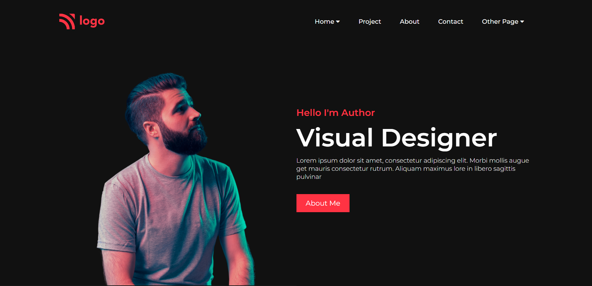
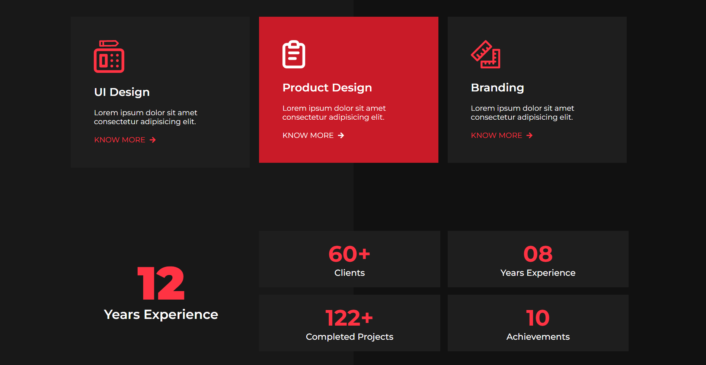
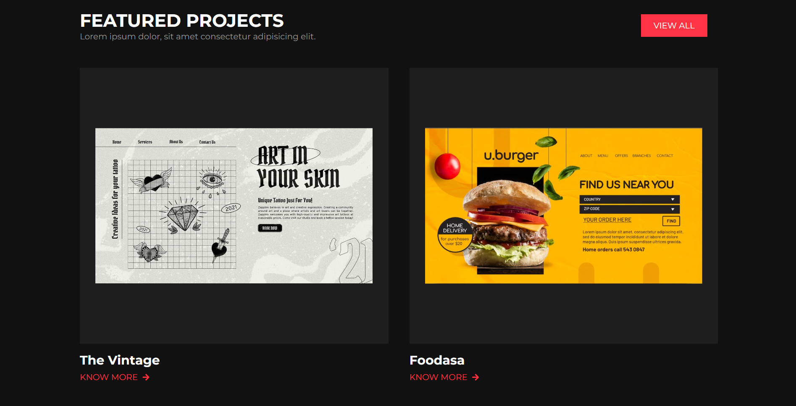
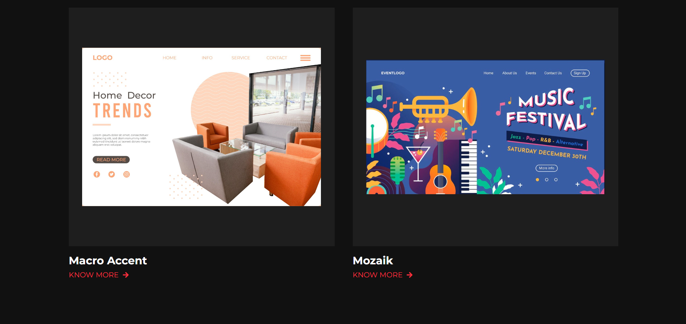
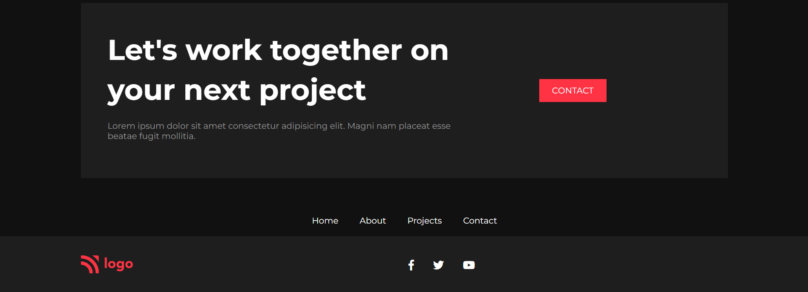

# Project-15
---

> Screen-Shot of the project.

#

## Built-with
---

This project is created using:

 1. HTML
 2. CSS

> This is responsive Webpage

#

## Live Project
---

This project is hosted on Netlify.

[Netlify](https://shobhits-live-project-15.netlify.app/)

#

## Time
---

This project was built within 6-7 hours. It covers major portion of CSS.

#

## Recommended Articles
---

Here are some recommended articles from which you can clear your concept.

> 1. [CSS Selectors](https://shobhitsheta.hashnode.dev/css-selector)
> 2. [CSS Position](https://shobhitsheta.hashnode.dev/css-position)
> 3. [CSS Flexbox](https://shobhitsheta.hashnode.dev/all-about-flexbox)

#

## About
---

Name: **Shobhit Sheta**

  